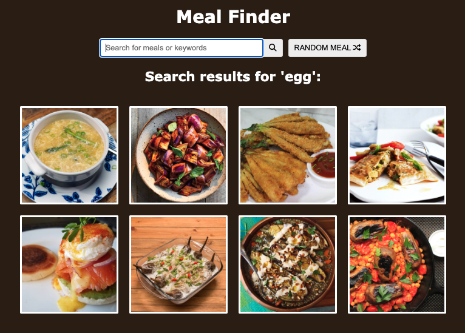

# meal-finder-api

### Meal API

[https://www.themealdb.com/](https://www.themealdb.com/)

### List of meals after typing search term. For instance, "egg":

### Click any meal listed in the list of meals will display selected meal info at the bottom

### RANDOM MEAL button clicked

